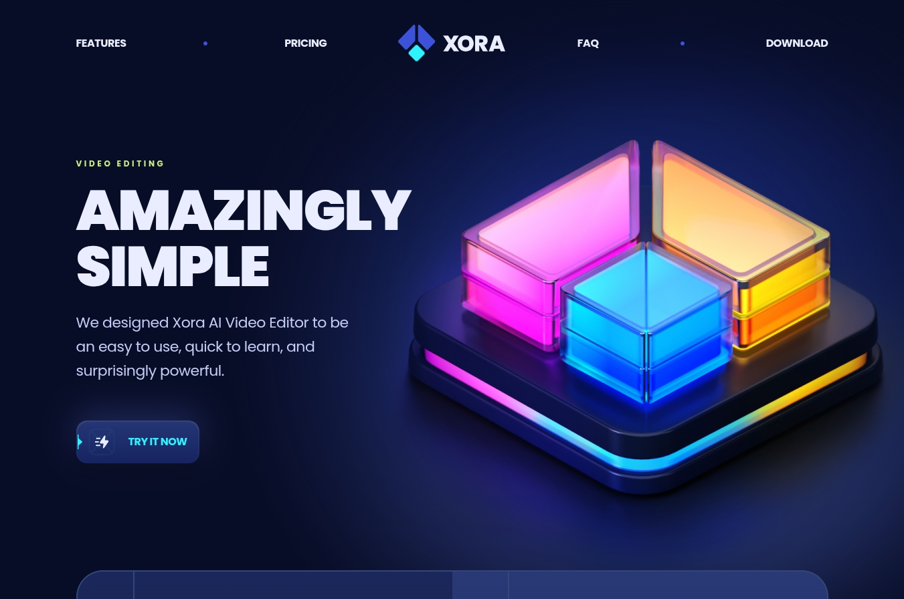

# Xora SaaS Landing Page



Xora is a responsive SaaS landing page rebuilt in Vue 3 from a React-based layout study. The project focuses on translating a polished marketing design into Vue single-file components, Tailwind CSS v4 utilities, typed content constants, accessible semantic sections, and responsive behavior across desktop and mobile screens.

## Tech Stack


## Features

- Vue 3 architecture using single-file components and `<script setup>`.
- TypeScript content modeling for plans, FAQ items, testimonials, logos, and links.
- Tailwind CSS v4 theme tokens through CSS-first `@theme` configuration.
- Custom utility classes for gradients, typography, spacing, layout, and component states.
- Responsive landing page sections for hero, features, pricing, FAQ, testimonials, download, header, and footer.
- Accessible semantic HTML improvements for navigation, lists, testimonials, download links, and image text.
- Smooth header state behavior with active section highlighting.
- SEO basics including metadata and a valid `robots.txt`.

## Project Structure

```txt
src/
  assets/
    images/          Static visual assets used by the UI
    styles/          Tailwind entry, theme tokens, and custom utilities
  components/
    layout/          Header and footer
    sections/        Landing page sections
    Button.vue       Shared CTA button
    FaqItem.vue      FAQ accordion item
    PricingCard.vue  Pricing plan card
    TestimonialItem.vue
  constants/
    icons.ts         SVG icon strings for platform links
    index.ts         Typed content used by the sections
  App.vue            Main page composition
  main.ts            Vue app entry
```

## Run Locally

Install dependencies:

```bash
pnpm install
```

Start the development server:

```bash
pnpm dev
```

Create a production build:

```bash
pnpm build
```

Preview the production build:

```bash
pnpm preview
```

## Documentation

The `docs` folder contains learning notes from the build:

- [Vue 3 Architecture](./docs/vue-architecture.md)
- [Tailwind CSS v4 Notes](./docs/tailwind-v4.md)
- [Performance and SEO Notes](./docs/performance-seo.md)
- [Reference Links](./docs/references.md)

## What I Learned

This project covers the practical differences between rebuilding a React landing page in Vue and implementing it with Vue conventions. The biggest lessons were component registration, asset imports, Tailwind CSS v4 CSS-first configuration, custom utilities with `@utility`, responsive layout translation, and how Lighthouse reports image delivery, render-blocking fonts, and development-server overhead.

## License

This project is available under the license included in the repository.
